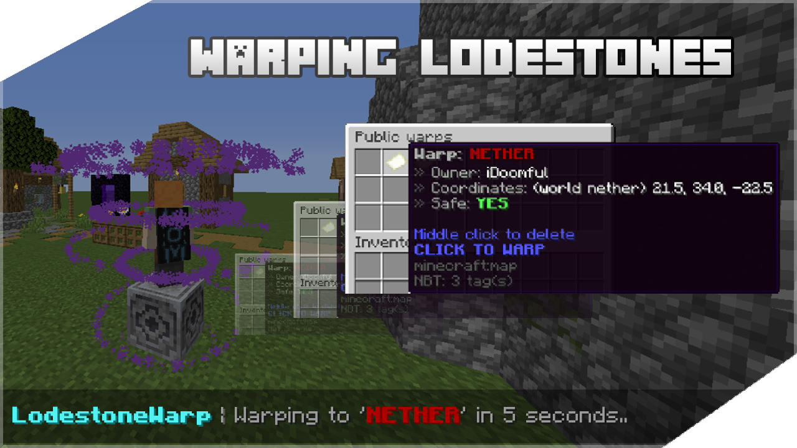

# Warping Lodestone



Similar to the [Waystones](https://www.curseforge.com/minecraft/mc-mods/waystones) mod, lodestone blocks can now be used as warping points with public, private and official global warp features. Requested by rebelmythik

## Acknowledgements
* This plugin is made with [Spigot API](https://www.spigotmc.org/), so it is unknown what will happen if it's ran on servers using Spigot forks such as [PaperSpigot](https://papermc.io/), [Purpur](https://purpurmc.org/), [Pufferfish](https://github.com/pufferfish-gg/Pufferfish), etc.
* It was made and tested on Minecraft version 1.17.1 only!
* There is optional [PlaceholderAPI](https://www.spigotmc.org/resources/placeholderapi.6245/) support for all config files

## Configuration files
[Messages](https://github.com/LiviuCocianu/warping-lodestones/blob/master/src/main/resources/messages.yml)
 | 
[Settings](https://github.com/LiviuCocianu/warping-lodestones/blob/master/src/main/resources/settings.yml)

## Commands and permissions
```
/lwarp reload
Reload the configuration files
(lodestonewarp.command.reload)

/lwarp version
Check the plugin version
(lodestonewarp.command.version)

/lwarp give <player> [amount]
Give a warping lodestone to someone
(lodestonewarp.command.give)

/lwarp adminwarp
Starts the global warp setup process
(lodestonewarp.command.adminwarp)
```

## Building
You will need [my custom dependency bundle](https://github.com/LiviuCocianu/bukkit-utils), containing all the required methods, to successfully build this project with Maven! Follow the instructions on the dedicated Github repository page to install it, then resume to this step (the dependency is already included in this pom.xml, you just need to follow step 1 and 2)

Also, make sure to change this section in pom.xml to your desired output path:

```XML
<outputFile>C:/Users/user/Desktop/${project.artifactId}-${project.version}.jar</outputFile>
```
